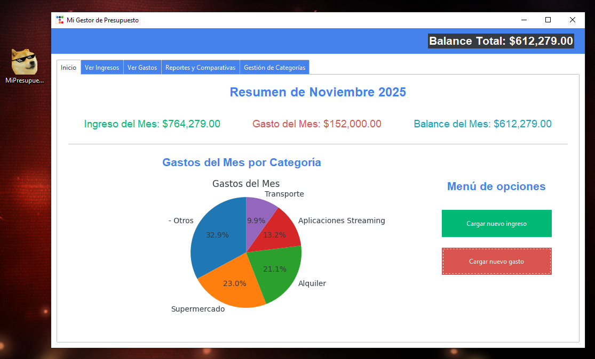

# 📊 Gestor de Presupuesto Personal

Una aplicación de escritorio simple pero potente para la gestión de finanzas personales, construida con Python, Tkinter (`ttkbootstrap`), SQLite y Matplotlib.



---

## ✨ Características Principales

Esta aplicación fue diseñada con una arquitectura modular y escalable, permitiendo una gestión completa del ciclo financiero personal.

* **Dashboard Interactivo:** Un resumen visual del mes en curso con KPIs (Ingresos, Gastos, Balance) y un gráfico de torta de gastos por categoría.
* **Gestión Completa (CRUD):** Funcionalidad completa para Crear, Leer, Actualizar (Editar) y Eliminar transacciones (ingresos y gastos).
* **Gestión de Categorías Avanzada:**
    * CRUD completo para categorías de ingreso y gasto.
    * **Fusión Inteligente:** Lógica para detectar e-mails duplicados al renombrar (ej: fusionar "Super" con "Supermercado"), reasignando todas las transacciones automáticamente.
    * **Borrado Seguro:** Evita la eliminación de categorías que ya tienen transacciones asociadas.
* **Reportes Dinámicos:** Una pestaña de reportes avanzada que permite filtrar por:
    * Tipo de transacción (Ingreso/Gasto).
    * Rango de fechas (Desde / Hasta).
    * Categoría específica (el menú se actualiza dinámicamente según el tipo).
* **Base de Datos Robusta:** Utiliza `SQLite3` para persistencia de datos local en un solo archivo.
* **Interfaz Moderna:** Construida con `ttkbootstrap` para un aspecto limpio y moderno, superando la apariencia nativa de Tkinter.

---

## 🛠️ Stack Tecnológico

* **Lenguaje:** Python 3
* **Base de Datos:** `SQLite3` (incluido en Python)
* **Interfaz Gráfica (UI):** `Tkinter` + `ttkbootstrap`
* **Visualización de Datos:** `Matplotlib`
* **Empaquetado:** `PyInstaller` (para generar el `.exe`)

---

## 🚀 Empezar (Modo Usuario)

Si solo querés usar la aplicación, no necesitás instalar Python.

1.  Andá a la sección **"Releases"** de este repositorio de GitHub.
2.  Descargá el archivo `.zip` de la última versión.
3.  Descomprimí la carpeta (`MiPresupuesto`) en cualquier lugar de tu PC.
4.  Ejecutá `MiPresupuesto.exe`.

La primera vez que se ejecute, se creará un archivo `presupuesto.db` en la misma carpeta para almacenar tus datos.

---

## 👨‍💻 Empezar (Modo Desarrollador)

Si querés ejecutar el código fuente, modificarlo o contribuir:

### 1. Prerrequisitos

* Python 3.8 o superior.
* `pip` (el gestor de paquetes de Python).

### 2. Instalación

1.  **Cloná el repositorio:**
    ```bash
    git clone https://github.com/leocorrea19/app-de-presupuesto-con-IA.git
    cd TU_REPOSITORIO
    ```

2.  **(Recomendado) Creá un entorno virtual:**
    ```bash
    python -m venv venv
    venv\Scripts\activate  # En Windows
    source venv/bin/activate # En macOS/Linux
    ```

3.  **Instalá las dependencias:**
    ```bash
    pip install ttkbootstrap matplotlib
    ```

4.  **Ejecutá la aplicación:**
    ```bash
    python main.py
    ```

### 3. Generar el Ejecutable (`.exe`)

Si hiciste cambios y querés volver a empaquetar la aplicación, usá `PyInstaller`.

1.  **Instalá PyInstaller:**
    ```bash
    pip install pyinstaller
    ```

2.  **Ejecutá el comando de compilación** (desde la raíz del proyecto):
    ```bash
    pyinstaller --windowed --name="MiPresupuesto" --icon="icon.ico" main.py
    ```
    * `--windowed`: Oculta la consola de terminal al ejecutar la app.
    * `--icon="icon.ico"`: Asigna tu ícono personalizado.

3.  Encontrarás tu aplicación lista para distribuir en la carpeta `dist/MiPresupuesto`.

---

## 📂 Estructura del Proyecto

El proyecto está organizado en módulos siguiendo el principio de Responsabilidad Única:

```
/control-de-presupuesto
|
|-- main.py               # 1. El "Lanzador": Inicia la aplicación.
|-- presupuesto_app.py    # 2. El "Orquestador": Contiene la ventana principal (PresupuestoApp) y la lógica global.
|-- database.py           # 3. El "Cerebro": Maneja toda la lógica y consultas a la base de datos SQLite.
|-- icon.ico              # Ícono de la aplicación.
|-- presupuesto.db        # Base de datos (se crea al ejecutar).
|
|-- /classes/             # 4. Los "Formularios": Clases para las ventanas pop-up.
|   |-- __init__.py
|   |-- formulario_ingreso.py
|   |-- formulario_gasto.py
|
|-- /tabs/                # 5. Las "Pestañas": Módulos que definen la UI y lógica de cada pestaña.
|   |-- __init__.py
|   |-- tab_inicio.py
|   |-- tab_ingresos.py
|   |-- tab_gastos.py
|   |-- tab_reportes.py
|   |-- tab_categorias.py
|
|-- README.md             # Este archivo.
```

---
